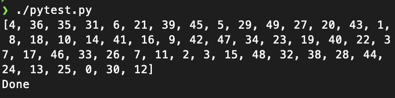

# Traveler salesman problem with multi-threaded genetic algorithm

## Tools
- `std::thread`
- `pybind11`

## Execution
```
./pytest.py
```

## API
- generate graph
    ```
    _graph.Graph(#_of_nodes, initial_vertex, random_graph)
    ``` 
- build environment according to the graph
    ```
    _Genetic.Genetic_thread(_graph.Graph, population_size, #_of_generations, mutation_rate, #_of_threads, show_population)
    ```
- run genetic algorithm
    ```
    _Genetic.Genetic_thread.run()
    ```

## Result
