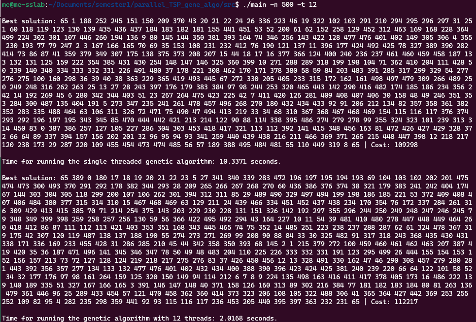

# Traveler salesman problem with multi-threaded genetic algorithm

## Tools
```
std::thread
```

## Execution
```
./main -t <number_of_threads> -n <number_of_nodes>
```

## Result
Solving TSP problem with 12 thread get about 4x speedup. Since we need to keep population always right, we need some mutex lock to keep operations work atomically, and hence the speedup is reasonable.
